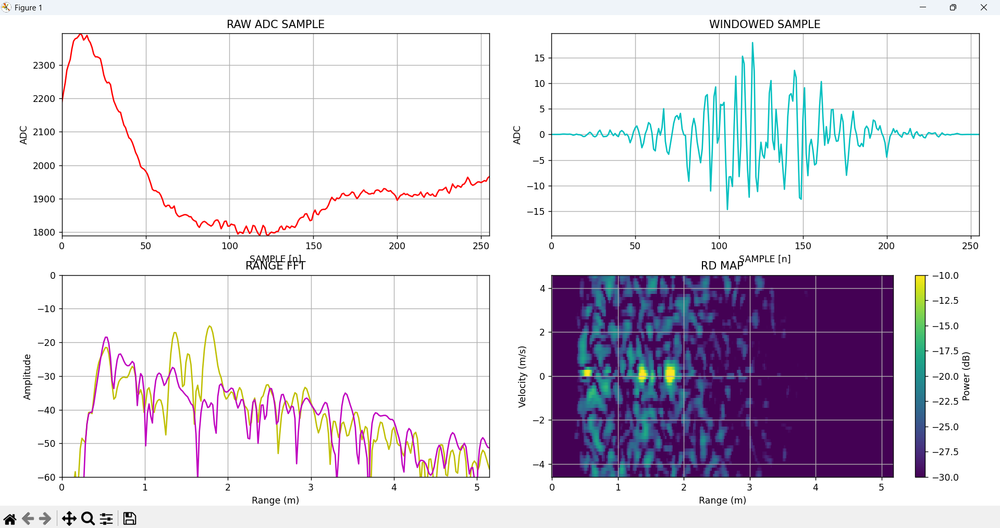
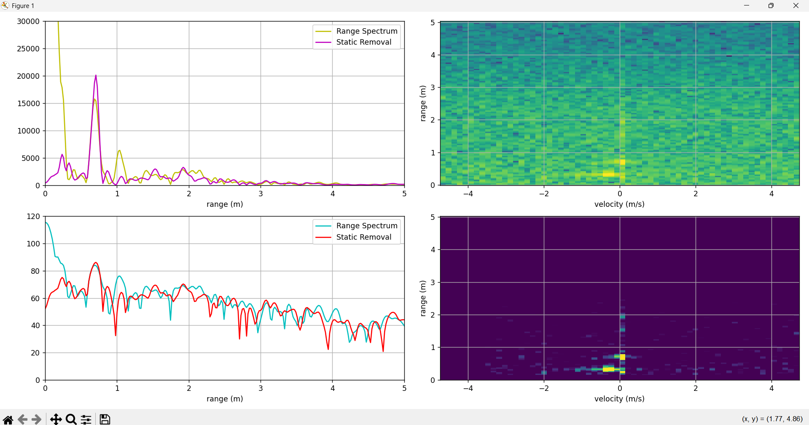
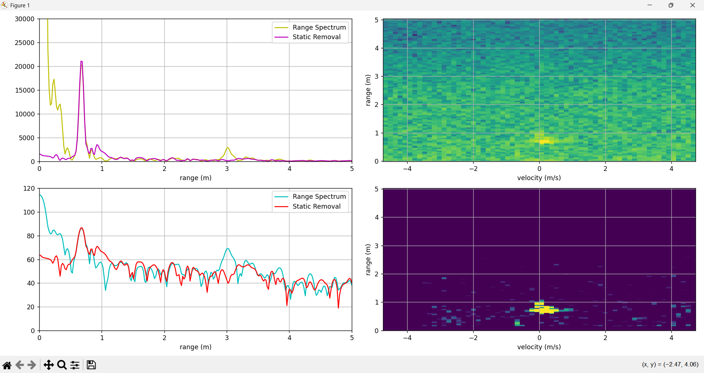
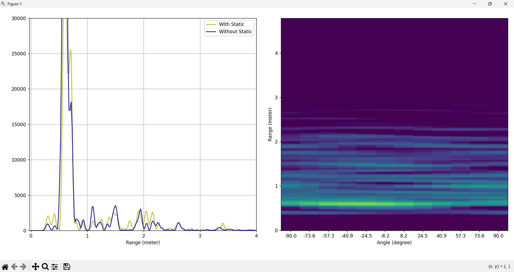
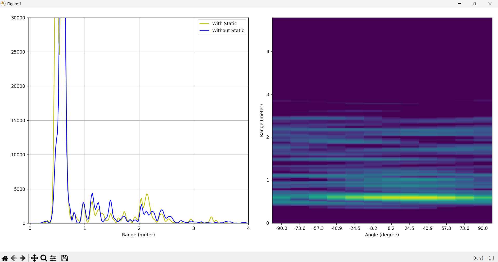

# FMCW Sensing with ESP-IDF

## What's the "FMCW" ?
**Frequency-Modulated Continuous-Wave:FMCW** is a technique of radar by sends out signals with 
changing frequency over time. Which is help improve the old radar systems that send out same frequency
pulse, FMCW significant improve distance and speed of radar.

## Sensor Infomation
I use is **BGT60TR13C** mmWave sensor from Infineon.
- Carrier frequency : 60GHz
- Bandwidth : 5GHz
- Number of TX : 1
- Number of RX : 3
- Antenna type : Antenna on Chip (AoC)
- Protocol : SPI 32 bit
  - [31:25] Address bit
  - [24:24] Read/Write bit
  - [23:00] Data bit

## Experiment
Firstly, I found out in doesn't have any library yet. So I start writing it from scratch base on the datasheet.
(https://www.infineon.com/assets/row/public/documents/24/49/infineon-bgt60tr13c-datasheet-en.pdf?fileId=8ac78c8c7d718a49017d94bac88e5d43)

And why I choose ESP-IDF over Arduino? It because the ESP-IDF is more flexible to control than Arduino, that why I choose ESP-IDF. The hardest thing is it was my frist time to use ESP-IDF so it take a while to learn this environment.

Let's move next to the **Processing** after get the raw data from sensor. 
1. Before processing any data, must clean the data for improve quality of data
- DC offset removal
- High Pass Filter
- Windowing (use the "Blackman window" to reduce sidelobe)
2. Use FFT along sample side (Fast-Time FFT) to convert frequency to range.

> static object on 0.5, 1.4, 1.8 meter

3. Found out the sensor detected all object not only person, so I use background subtraction to remove the static object out i.e. Wall or any furniture.

> no person here

4. Then, FFT along Chirp side (Slow-Time FFT) to convert phase different to velocity.

> person here

5. The output give low SNR (signal to noise ratio), so I use **CFAR** method to find the peak among the signal.

> upper right : before apply CFAR | lower right : after apply CFAR

6. Use FFT along the receiver number but it give bad resolution because the **Angle of Arrival (AoA)** need many receiver array. I try to compensated the receiver by zero padding, so the result it give are more visualize but still bad quality to use.

> person on the left side

> person on the right side
